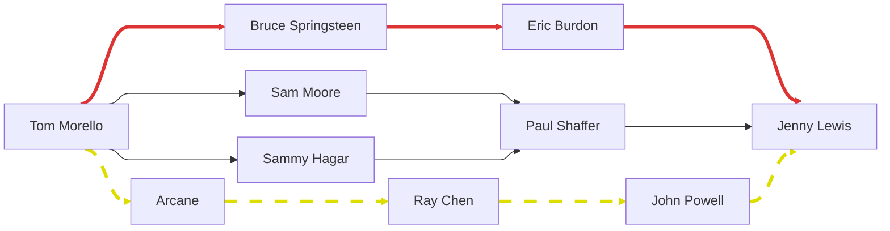
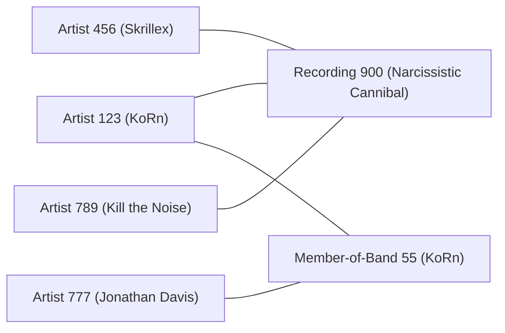

# Music Collaboration Number Calculator

Search and graph tooling for the Music Collaboration Number (MCN) / Springsteen Number. Play with it online using the [Web App](). The graph is built from MusicBrainz data and represents artists connected by shared recording credits or band membership using:
- `recording`
- `artist_credit_name`
- `artist`
- `link_type`
- `link`
- `l_artist_artist`


## Table of Contents

- [Table of Contents](#table-of-contents)
- [Music Collaboration Number?](#music-collaboration-number)
  - [Collaboration Numbers](#collaboration-numbers)
  - [MCN and the Springsteen Number](#mcn-and-the-springsteen-number)
  - [Music Collaboration Graph](#music-collaboration-graph)
- [Deploying it yourself.](#deploying-it-yourself)
  - [Graph Builder](#graph-builder)
  - [Search Tool](#search-tool)
  - [Local API](#local-api)
  - [A checklist for me to remember lol:](#a-checklist-for-me-to-remember-lol)
- [Graph Statistics and Summary](#graph-statistics-and-summary)
  - [Graph Statistics](#graph-statistics)
  - [Artist Credit Statistics](#artist-credit-statistics)
  - [Recording Statistics](#recording-statistics)
  - [Membership Statistics](#membership-statistics)
  - [Artist Filtering](#artist-filtering)


## Music Collaboration Number?

### Collaboration Numbers
In academia, there is the concept of a "collaboration number" between two researchers, based on co-authorship of papers. The most famous example is the Erdős number, which measures the collaborative distance between Paul Erdos and an author (usually in math or a closely related field). Similarly, in film, there is the concept of a Bacon number, which measures the collaborative distance between an actor and Kevin Bacon. Finally, in live music, there is also the concept of a Sabbath number, which measures the collaborative distance between a performer and Black Sabbath.

Here is a link dump of interesting things to send you on a rabbit hole:
 - [Collaboration Graphs](https://en.wikipedia.org/wiki/Collaboration_graph)
 - [Erdos Number](https://en.wikipedia.org/wiki/Erd%C5%91s_number)
 - [Erdos Bacon](https://en.wikipedia.org/wiki/Erd%C5%91s%E2%80%93Bacon_number)
 - [Six Degrees of Separation](https://en.wikipedia.org/wiki/Six_degrees_of_separation)
 - [Erdos Number calculator](https://www.csauthors.net/distance)
 - [Solving the Bacon Number Problem](https://labs.acme.byu.edu/Volume2/BreadthFirstSearch/BreadthFirstSearch.html#the-kevin-bacon-problem)


### MCN and the Springsteen Number
A Music Collaboration Number (MCN) seems similar to the Sabbath number, but instead of measuring collaboration as performance with an artist, it measures collaboration as co-artistship on recordings or band membership. The Springsteen number, of course is the MCN between an artist and Bruce Springsteen (In the future, I may or may not elaborate as Springsteen as the choice for this metric, but for now, I will say it is with good reason).

### Music Collaboration Graph
For more in depth information on how to solve for a collaboration number, see [Intro to Graphs](https://courses.cit.cornell.edu/info204_2007sp/graphs.pdf) and [Solving the Bacon Number Problem](https://labs.acme.byu.edu/Volume2/BreadthFirstSearch/BreadthFirstSearch.html#the-kevin-bacon-problem). This repo uses Bidirectional BFS on a Bipartite Graph featuring artist and connector nodes.

Lets look at an example. Below, I have included a subgraph of the Music Collaboration Graph that shows *just a few* of the paths between Tom Morello and Jenny Lewis. 


Of the paths shown above, there are 3 that are the shortest path between Tom Morello and Jenny Lewis with a distance of 3 (3 edges). These paths are:
1. `Tom Morello -> Bruce Springsteen -> Eric Burdon -> Jenny Lewis`
2. `Tom Morello -> Sam Moore -> Paul Shaffer -> Jenny Lewis`
3. `Tom Morello -> Sammy Hagar -> Paul Shaffer -> Jenny Lewis`

Note that paths 2 and 3 both go through Paul Shaffer, but they are still considered distinct paths because they have different first vertices.

The path `Tom Morello -> Arcane -> Ray Chen -> John Powell -> Jenny Lewis` is an example of a longer path with 4 edges.

This graph above has `10 vertices` and `12 edges`. The real MCN graph has roughly `1 Million vertices/artists`, and `14 Million edges/relationships`. Furthermore, the graph above only shows relevant paths between Tom Morello and Jenny Lewis, but Tom Morello and Jenny Lewis are connected to many other artists, so the real graph is much more complex. More importantly, it is important to consider the how many artists each artist is connected to. On average, each artist is connected to `10 other artists/degree`, but this statistic is quite skewed. 

A more comprehensive summary of the graph can be found in the [Graph Statistics and Summary](#graph-statistics-and-summary) section.


## Deploying it yourself.
There are four components to this project: the graph builder, the search tool, the API, and the frontend. The frontend is in a different repo, but the other three components are in this repo.

### Graph Builder
This project is made with data from MusicBrainz. Because of the rate limits, it is much better to download the full MusicBrainz dump and build the graph locally. The graph builder is in `scripts/build_graph.py`. It takes a MusicBrainz dump directory and outputs a graph artifact directory. The graph artifact directory contains the following files:
- `meta.json`: metadata about the graph, including the number of vertices and edges.
- `artists.jsonl`: a JSONL file containing all the artists in the graph.
- `connectors.jsonl`: a JSONL file containing all the connectors in the graph.
- `adjacency.pkl`: a pickled adjacency list of the graph. 

`adjacency.pkl` stores the graph as a dictionary, where the keys are artist IDs and the values are lists of connector IDs. The connectors are stored in `connectors.jsonl`, which contains the connector ID, the type of connector (recording or member-of-band), and the list of artist IDs that are connected by that connector. For example:
```json
{
    "a:123": ["r:900", "m:55"],
    "r:900": ["a:123", "a:456", "a:789"],
    "a:456": ["r:900"],
    "m:55": ["a:123", "a:777"],
}
```
represents the adjacencies:



The graph can be built using the command:
```bash
python scripts/build_graph.py --dump-dir data/mbdump --out data/artifacts/graph
```

This builds the graph while ignoring artists with more than 100,000 recordings and artists with "various" in their name. 

Ideally, this graph refreshes automatically, for which there is a script `scripts/refresh_graph.py`. Run it as
```bash
python scripts/refresh_graph.py \
  --data-root data \
  --keep-graph-versions 2 \
  --min-free-gb 45 \
  --service-name music-mcn-api \
  --restart-service
  ```


### Search Tool
The search tool is in `scripts/search_path.py`. It takes a graph artifact directory, a source artist name or MBID, and a target artist name or MBID, and outputs the shortest path between the two artists. The search tool uses a bidirectional breadth-first search (BFS) to find the shortest path between the two artists. The search tool can be run as:
```bash
python scripts/search_path.py \
  --graph data/artifacts/current \
  --source "Bruce Springsteen" \
  --target "Freddie Mercury"
```

The output includes the resolved artists, MCN hop count, raw bipartite path, and collapsed artist-to-artist path. Name lookup accepts an artist name or MBID. For duplicate names, it prefers the uniquely highest-degree exact or case-insensitive match and fails with top candidates if the best matches are still tied. 

The search tool can also be run with the MBIDs of the artists, which means that a GUI may easily use this to take an unambiguous artist name and resolve it to an MBID, then use the MBID to search for the shortest path.


### Local API
A local api is available as a FastAPI wrapper around the search tool. It can be run as:
```bash
python scripts/run_api.py --graph data/artifacts/current --host 127.0.0.1 --port 8000
```
For deployment, configure explicit frontend origins in the environment.

### A checklist for me to remember lol:
1. Clone the repo on the VPS.
2. Create and activate a Python virtual environment with `FastAPI` and `Uvicorn`.
3. Build the graph and start refresh.
4. Create `deploy/.env` from `deploy/.env.example`.
5. Install and enable the systemd API service.
6. Install Caddy or Nginx reverse proxy.
7. Run `python scripts/smoke_api.py --base-url http://127.0.0.1:8000` to verify the API is working.
8. Test it through the public HTTPS URL.

## Graph Statistics and Summary
This is as of July 2026

### Graph Statistics
| Metric | Value |
|-------|------:|
| Adjacency Nodes | 7,358,713 |
| Artist Nodes | 1,294,529 |
| Connector Nodes | 6,064,184 |
| Artist-Artist Relationships Seen | 841,678 |

### Artist Credit Statistics
| Metric | Value |
|-------|------:|
| Artist Credit Name Rows | 6,988,833 |
| Artist Credit Name Rows Used for Artist Volume | 5,836,661 |
| Artist Credits with Kept Artists | 3,303,524 |
| Artist Credits with Recordings | 3,305,759 |
| Multi-Artist Credits | 1,650,895 |
| Multi-Artist Credits (After Dedupe) | 1,649,454 |

### Recording Statistics
| Metric | Value |
|-------|------:|
| Recordings Seen | 39,340,534 |
| Recording Connectors | 5,424,518 |
| Recording Raw Edges | 12,983,888 |
| Raw Bipartite Edges | 14,263,220 |

### Membership Statistics
| Metric | Value |
|-------|------:|
| Membership Connectors | 639,666 |
| Membership Raw Edges | 1,279,332 |
| Member-of-Band Link IDs | 72,838 |
| Member-of-Band Link Type IDs | `103` |

### Artist Filtering
| Metric | Value |
|-------|------:|
| Artists Over Recording Limit | 1 |
| Ignored Artists (Has "various" in Name) | 48 |
| Ignored Artists (Over 100,000 Recording Limit) | 1 |
| **Total Ignored Artists** | **49** |
| Used Artist IDs Missing from Artist Table | 0 |
